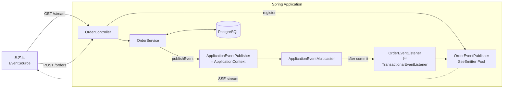
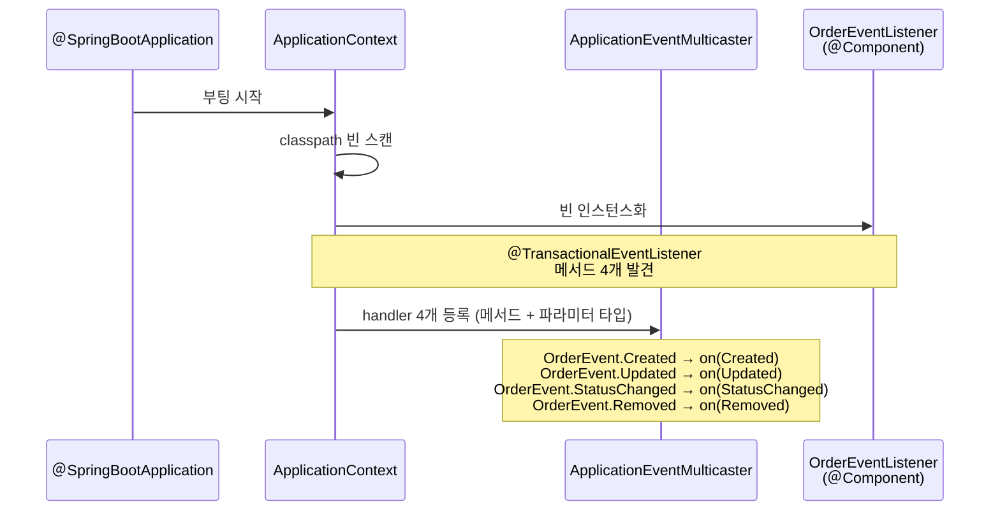
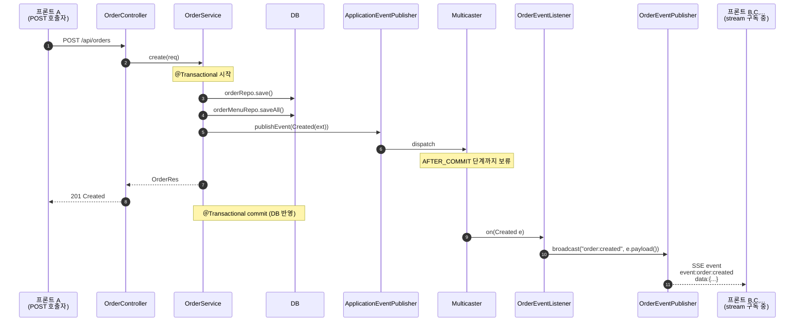
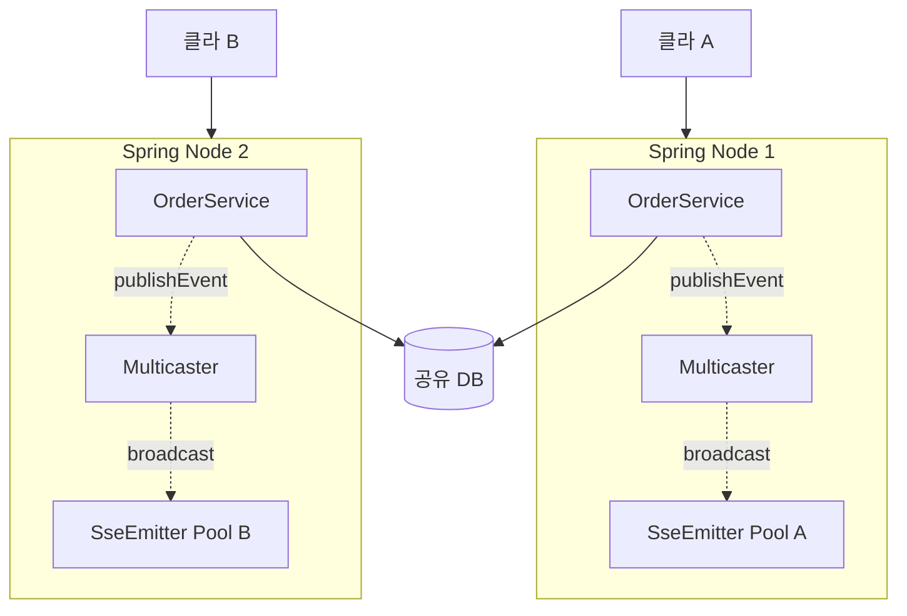

# SSE 구현 방안 — 주문 이벤트 broadcast

프론트 [WEBSOCKET_PLAN.md](../../../cheonil-restaurant-next/docs/plan/WEBSOCKET_PLAN.md) 의 실시간 동기화를 SSE 로 구현하는 백엔드 설계안.

> 프로토콜 비교 검토는 [SSE / WS / STOMP 비교 노트](https://www.notion.so/34e705ffd2658101af0fe294b75db89b) 참조.

---

## 1. 목표

주문 도메인의 변경 이벤트를 모든 연결된 클라이언트에 실시간 push.

| 이벤트                 | 발생 시점                              | Payload                        |
| ---------------------- | -------------------------------------- | ------------------------------ |
| `order:created`        | POST `/orders` 트랜잭션 commit 후      | `OrderExtRes` (전체 aggregate) |
| `order:updated`        | PUT `/orders/{seq}` commit 후          | `OrderExtRes`                  |
| `order:status-changed` | PATCH `/orders/{seq}/status` commit 후 | `OrderStatusChangeRes`         |
| `order:removed`        | DELETE `/orders/{seq}` commit 후       | `{ "seq": Long }`              |

이벤트 네이밍: `<도메인>:<액션>` (콜론 구분, 프론트 plan 합의).

---

## 2. 엔드포인트

```
GET /api/orders/stream
  Accept: text/event-stream
  Response:
    Content-Type: text/event-stream
    Connection: keep-alive

    event: order:created
    data: {"seq":101, ...}

    event: order:status-changed
    data: {"seq":101, "status":"COOKED", ...}
```

- 클라이언트는 `EventSource('/api/orders/stream')` 로 연결
- 단일 stream 으로 4종 이벤트 모두 수신 (`event:` 필드로 분기)
- `WebConfig.addPathPrefix("/api", ...)` 가 자동으로 `/api` 부착

---

## 3. 컴포넌트 구조

### 3-1. 신규 파일

```
order/
├── OrderEventPublisher.java   ← SseEmitter pool + broadcast
└── OrderController.java       ← @GetMapping("/stream") 추가
```

### 3-2. 수정 파일

- `OrderService.java` — 4개 mutation 메서드에서 publisher 호출

### 3-3. 책임 분리

| 컴포넌트                   | 책임                                   |
| -------------------------- | -------------------------------------- |
| `OrderEventPublisher`      | SseEmitter 등록/해제, broadcast        |
| `OrderController#stream()` | HTTP 핸드셰이크 → emitter 발급         |
| `OrderService`             | 비즈니스 로직 commit 후 publisher 호출 |

---

## 4. OrderEventPublisher 설계

```java
@Component
@Slf4j
public class OrderEventPublisher {

    private static final long TIMEOUT_INFINITE = 0L;
    private final List<SseEmitter> emitters = new CopyOnWriteArrayList<>();

    /** 새 클라이언트 연결 — emitter 발급 + pool 등록. */
    public SseEmitter register() {
        SseEmitter emitter = new SseEmitter(TIMEOUT_INFINITE);
        emitters.add(emitter);
        emitter.onCompletion(() -> emitters.remove(emitter));
        emitter.onTimeout(() -> emitters.remove(emitter));
        emitter.onError(e -> emitters.remove(emitter));
        return emitter;
    }

    /** 모든 연결된 클라이언트에 broadcast. */
    public void broadcast(String eventName, Object payload) {
        for (SseEmitter em : emitters) {
            try {
                em.send(SseEmitter.event().name(eventName).data(payload));
            } catch (IOException e) {
                em.complete();   // onCompletion → pool 자동 정리
            }
        }
    }
}
```

### 핵심 설계 결정

- **`CopyOnWriteArrayList`** — 동시 register/remove + iterate 가 락 없이 안전
- **`TIMEOUT_INFINITE = 0L`** — Spring 기본 30초 타임아웃 회피, 클라이언트가 끊을 때까지 유지
- **3가지 정리 콜백** (`onCompletion`, `onTimeout`, `onError`) — 어떤 경로로 끊겨도 pool 에서 제거
- **broadcast 실패 시 emitter.complete()** — 죽은 연결은 다음 round 에서 자동 제거

### Reactive 대안 (검토)

`Flux<ServerSentEvent>` + `Sinks.Many` 조합도 가능하지만, 현 프로젝트는 MVC stack (`spring-boot-starter-webmvc`) 이라 `SseEmitter` 가 자연스러움. WebFlux 도입 시 재검토.

---

## 5. OrderController 추가

```java
@GetMapping(value = "/stream", produces = MediaType.TEXT_EVENT_STREAM_VALUE)
public SseEmitter stream() {
    return orderEventPublisher.register();
}
```

- 의존성에 `OrderEventPublisher` 주입 추가
- `produces` 명시 — `text/event-stream` 헤더 자동 설정
- 별도 `OrderStreamController` 분리 불필요 (도메인 같음, 간단함)

---

## 6. OrderService 변경

각 mutation 메서드의 **commit 직전** 또는 메서드 종료 직전에 publisher 호출.

### 6-1. create

```java
@Transactional
public OrderRes create(OrderCreateReq ocReq) {
    // ... 기존 로직 ...
    Order saved = orderRepo.save(order);
    // ... orderMenu saveAll ...

    OrderRes res = toCreateRes(saved, menus);

    // SSE broadcast — full aggregate 로 변환 후 push
    OrderExtRes ext = assemble(List.of(saved)).getFirst();
    eventPublisher.broadcast("order:created", ext);

    return res;
}
```

⚠️ REST 응답은 `OrderRes` (현재 포맷 유지), SSE 이벤트는 `OrderExtRes` (프론트가 카드 렌더에 즉시 사용).

### 6-2. update

```java
@Transactional
public OrderExtRes update(Long seq, OrderCreateReq ocReq) {
    // ... 기존 로직 ...
    OrderExtRes ext = assemble(List.of(order)).getFirst();
    eventPublisher.broadcast("order:updated", ext);
    return ext;
}
```

REST 응답이 이미 `OrderExtRes` 라 동일 객체 재사용.

### 6-3. changeStatus

```java
@Transactional
public OrderStatusChangeRes changeStatus(Long seq, OrderStatus newStatus) {
    // ... 기존 로직 ...
    OrderStatusChangeRes res = new OrderStatusChangeRes(...);
    eventPublisher.broadcast("order:status-changed", res);
    return res;
}
```

### 6-4. remove

```java
@Transactional
public void remove(Long seq) {
    // ... 기존 로직 ...
    eventPublisher.broadcast("order:removed", Map.of("seq", seq));
}
```

---

## 7. 트랜잭션과 broadcast 의 순서 고민

### 문제

`@Transactional` 메서드 내에서 `broadcast()` 를 호출하면, **트랜잭션이 commit 되기 전에 이벤트가 나갈 수 있다**.

시나리오:

1. Service 가 publisher.broadcast 호출 → 클라이언트가 이벤트 수신 → REST 로 `GET /orders` 재조회
2. 그런데 트랜잭션 commit 이 아직 안 됨 → DB 에 없는 데이터 → 클라이언트가 이전 상태만 봄
3. 잠시 뒤 commit → 다음 변경 때 정합성 회복 (자체 보정)

### 해결책

#### A. 메서드 종료 (commit) 이후 publish — `TransactionSynchronizationManager`

```java
TransactionSynchronizationManager.registerSynchronization(
    new TransactionSynchronization() {
        @Override
        public void afterCommit() {
            eventPublisher.broadcast(eventName, payload);
        }
    }
);
```

- **commit 성공 후에만** broadcast
- rollback 시 자동으로 broadcast 안 됨
- 권장

#### B. ApplicationEventPublisher + `@TransactionalEventListener`

```java
// Service
applicationEventPublisher.publishEvent(new OrderCreatedEvent(extRes));

// Listener
@TransactionalEventListener(phase = TransactionPhase.AFTER_COMMIT)
public void on(OrderCreatedEvent event) {
    orderEventPublisher.broadcast("order:created", event.payload());
}
```

- Spring 의 표준 이벤트 시스템 + 트랜잭션 단계 명시
- 더 명확하고 테스트 쉬움
- 별도 Event 클래스 4개 필요

#### C. 현재 방식 (commit 전 호출)

- 가장 단순
- 정합성 약간 어긋날 수 있음 (시나리오 위)
- 클라이언트가 멱등 update + 다음 이벤트로 자동 보정 가능

→ **권장: B (TransactionalEventListener)**. 가장 클린.
→ MVP 라면 A 도 OK.
→ C 는 시작 단계엔 충분히 동작하지만 권장 X.

### 결정 (제안)

**A 로 시작 → 도메인 늘면 B 로 마이그레이션**.
이유: B 는 Event 클래스 4개 + Listener 클래스 추가가 부담. A 는 현 구조에 한 줄 추가로 끝.

---

## 8. 이벤트 흐름 다이어그램

`ApplicationEventPublisher` → `OrderEventListener` → `SseEmitter` 까지의 전체 흐름.

### 8-1. 시스템 구조 (정적)



REST mutation 과 SSE stream 두 경로가 `OrderController` 에서 갈리고, 결과적으로 `SseEmitter Pool` 을 통해 다시 만남.

### 8-2. 부팅 시점 — listener 자동 등록



부팅 1회만 발생. 이후 multicaster 가 listener 레지스트리 보유.

### 8-3. 런타임 — POST 부터 SSE 전송까지



핵심:

- 5번에서 `publishEvent` 호출하지만 listener 는 **즉시 호출 안 됨**
- 트랜잭션 commit (10번) 이후에야 11번 listener 호출
- 즉 client 응답 (9번 201 Created) 보다 SSE broadcast (12번) 가 약간 늦을 수 있음 (정상)

### 8-4. 트랜잭션 phase 와의 관계

```mermaid
gantt
    title @Transactional 메서드 내 publishEvent 동작
    dateFormat X
    axisFormat %s

    section Service 메서드
    @Transactional 시작           :milestone, t0, 0, 0
    DB 작업 (save, saveAll)        :a1, 0, 3
    publishEvent (즉시 dispatch X) :milestone, t1, 3, 0
    메서드 종료                    :a2, 3, 4
    @Transactional commit          :milestone, t2, 4, 0

    section Listener (AFTER_COMMIT)
    Listener 호출                   :milestone, t3, 4, 0
    SSE broadcast                  :a3, 4, 6
```



- `publishEvent` 자체는 동기 호출 (즉시 반환), 단 listener 호출은 **commit 이후로 지연**
- 만약 트랜잭션이 rollback 되면 listener 는 **호출 안 됨** → 이벤트 자동 무시
- 결과적으로 "DB 에 반영된 변경만 broadcast" 보장

### 8-5. 멀티 인스턴스 한계



- **ApplicationEventPublisher 는 같은 JVM 내 통신만** → Node 1 의 mutation 은 Node 2 의 SseEmitter Pool 에 도달 못 함
- 다중 노드 운영 시 **노드 간 메시지 broker** 필요 (Redis Pub/Sub, Kafka, RabbitMQ)
- 또는 STOMP + 외부 broker 로 전환

→ 현 단계 (단일 노드) 에선 문제 없음. §13 단점 표 참조.

---

## 9. 인증 / 권한

### 현재 상태

프로젝트에 Spring Security 미도입. 모든 endpoint open.

### SSE 인증 시 고려사항

`EventSource` 가 **Authorization 헤더 못 넣음** → 3가지 우회:

| 방법                                        | 비고                                                                  |
| ------------------------------------------- | --------------------------------------------------------------------- |
| **Cookie 기반**                             | 가장 표준. 백엔드는 `withCredentials` 활성화 + CORS allow-credentials |
| **Query param** `?token=...`                | URL 노출. 로그/리퍼러 누출 위험                                       |
| **EventSourcePolyfill** (프론트 라이브러리) | 헤더 지원, 의존성 추가                                                |

→ **현재 단계엔 인증 보류** (Spring Security 도입 시 함께 설계).
→ 도입 시 Cookie 권장.

---

## 10. CORS / Proxy

### 개발 환경

Vite proxy `/api → http://localhost:8080` 로 SSE 도 그대로 통과.

- Vite 의 `http-proxy` 는 streaming 지원 (별도 설정 불필요)

### 프로덕션

다른 origin 에서 호출 시:

```java
@Configuration
public class WebConfig implements WebMvcConfigurer {
    @Override
    public void addCorsMappings(CorsRegistry registry) {
        registry.addMapping("/api/**")
            .allowedOrigins("https://...")
            .allowedMethods("*")
            .allowCredentials(true);   // SSE cookie 인증 시
    }
}
```

기존 `WebConfig.java` 에 추가.

---

## 11. heartbeat / keep-alive

### 문제

연결 후 일정 시간 (보통 30초~수 분) 메시지가 없으면:

- 일부 프록시/방화벽이 idle connection 끊음
- 브라우저는 자동 재연결하지만 일시적 disconnect 발생

### 해결책

주기적으로 comment line 전송:

```java
@Scheduled(fixedRate = 15_000)
public void heartbeat() {
    for (SseEmitter em : emitters) {
        try {
            em.send(SseEmitter.event().comment("ping"));
        } catch (IOException e) {
            em.complete();
        }
    }
}
```

- comment (`:` 로 시작) 는 클라가 무시 → 비즈니스 영향 0
- `@EnableScheduling` 필요

→ MVP 단계 보류, 운영 환경에서 disconnect 빈발하면 도입.

---

## 12. 단계별 구현 순서

1. **OrderEventPublisher** 작성 (가장 단순한 형태)
2. **OrderController** 에 `/stream` 엔드포인트 추가
3. **OrderService 4개 메서드**에 broadcast 호출 추가 (afterCommit hook 사용 — 옵션 A)
4. **수동 검증** — curl 또는 브라우저 DevTools 로 stream 연결 확인
   ```bash
   curl -N http://localhost:8080/api/orders/stream
   ```
   다른 터미널에서 POST /orders 실행 → curl 출력에 이벤트 표시 확인
5. **Swagger UI** 에서 stream endpoint 노출 확인
6. **(이후) heartbeat** — disconnect 빈발 시
7. **(이후) Spring Security + cookie 인증** 도입 시 통합

---

## 13. 단점 / 알려진 한계

| 항목                                  | 영향                                                                                    | 대응                                                                    |
| ------------------------------------- | --------------------------------------------------------------------------------------- | ----------------------------------------------------------------------- |
| **단일 노드 한정**                    | 다중 인스턴스 운영 시 각 노드의 emitter pool 분리 → 모든 클라이언트에게 broadcast 안 됨 | 노드 간 메시지 공유 (Redis Pub/Sub, Kafka). 또는 STOMP + RabbitMQ relay |
| **모든 emitter 에 동일 브로드캐스트** | 매장별 권한 분리 불가                                                                   | 향후 emitter 에 메타정보 (storeSeq) 부여 + filter                       |
| **EventSource 헤더 제약**             | JWT 인증 시 cookie / query param 우회 필요                                              | 인증 도입 시 cookie 표준 채택                                           |
| **트랜잭션 commit 타이밍**            | broadcast 가 commit 전 발생하면 정합성 어긋남                                           | afterCommit hook (§7)                                                   |
| **메시지 누락 (재연결 갭)**           | 일시 disconnect 동안 발생한 이벤트 손실                                                 | 재연결 시 클라가 invalidate → fresh fetch (프론트 plan §6-2)            |

---

## 14. 결정 필요 항목

- [ ] **트랜잭션 hook 방식** — A (afterCommit 직접) vs B (TransactionalEventListener)
  - B로 구현
- [ ] **CORS 설정 시점** — 지금 추가 vs 프로덕션 빌드 시점
  - 인증은 추후에
- [ ] **heartbeat 도입 시점** — MVP 보류 vs 처음부터
  - 처음부터
- [ ] **인증 통합 일정** — Spring Security 도입과 동기화
  - 인증은 추후에

---

## 15. 참고

- 프론트 plan: [WEBSOCKET_PLAN.md](../../../cheonil-restaurant-next/docs/plan/WEBSOCKET_PLAN.md)
- 비교 노트: [SSE / WebSocket / STOMP 비교](https://www.notion.so/34e705ffd2658101af0fe294b75db89b)
- SSE 정리: [SSE (Server-Sent Events) 정리](https://www.notion.so/34e705ffd26581219c17d4797a5d90df)
- Spring SseEmitter: https://docs.spring.io/spring-framework/docs/current/javadoc-api/org/springframework/web/servlet/mvc/method/annotation/SseEmitter.html
